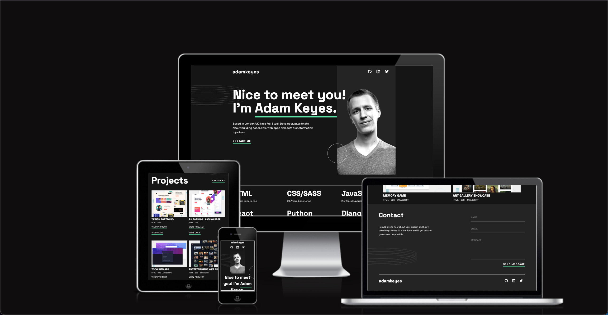

# Frontend Mentor - Single-page developer portfolio solution

This is a solution to the [Single-page developer portfolio challenge on Frontend Mentor](https://www.frontendmentor.io/challenges/singlepage-developer-portfolio-bBVj2ZPi-x). Frontend Mentor challenges help you improve your coding skills by building realistic projects.

## Table of contents

- [Overview](#overview)
  - [The challenge](#the-challenge)
  - [Screenshot](#screenshot)
  - [Links](#links)
- [My process](#my-process)
  - [Built with](#built-with)
  - [What I learned](#what-i-learned)
  - [Continued development](#continued-development)
- [Author](#author)
- [Acknowledgments](#acknowledgments)

**Note: Delete this note and update the table of contents based on what sections you keep.**

## Overview

### The challenge

Users should be able to:

- Receive an error message when the `form` is submitted if:
  - Any field is empty
  - The email address is not formatted correctly
- View the optimal layout for the interface depending on their device's screen size
- See hover and focus states for all interactive elements on the page
- **Bonus**: Hook the form up so it sends and stores the user's enquiry (you can use a spreadsheet or Airtable to save the enquiries)
- **Bonus**: Add your own details (image, skills, projects) to replace the ones in the design

### Links

- Solution URL: [Check out my solution](https://github.com/OliverCadman/portfolio_website)
- Live Site URL: [Check out my site](https://olivercadman.github.io/portfolio_website/)

## My process

### Built with

- Semantic HTML5 Markup
- SASS
- Flexbox
- CSS Grid
- Mobile-first workflow
- [React](https://reactjs.org/) - JS library
- [SASS](https://sass-lang.com/) - CSS Pre-processor
- [Vite](https://vitejs.dev/) - React build tool
- [EmailJS](https://www.emailjs.com/) - An SMTP service hooked up to the contact form.
- [React Toastify](https://www.npmjs.com/package/react-toastify) - Displays toasts to users upon submitting the contact form.
- [Github Actions/Pages](https://github.com/actions/deploy-pages) - Github Actions used to implement a CI/CD pipeline for deployment.

**Note: These are just examples. Delete this note and replace the list above with your own choices**

### What I learned

I used this small project as an opportunity to try out a little TypeScript. Upon reflection, the predominantly static nature of this website may render typescript quite redundant! Nonetheless, there were some bits of functionality I implemented which allowed me to try out TypeScript. To be fair, I didn't encounter many bugs at run time, so maybe using TypeScript was a good idea afterall!

Through working on the hero section on desktop, I initially created the background space on the left and right side by adding a bunch of padding. However, I learned that the better way to approach this was to add a max width on desktop sizes, so that the width of the text and image positioning remained consistent when resizing the screen width.

### Continued development

I'm going to customize this website to use for my own portfolio of work. I hope that's ok Frontend Mentor dudes!

## Author

- LinkedIn - [Oliver Cadman](https://www.linkedin.com/in/oliver-cadman/)
- Frontend Mentor - [@olivercadman](https://www.frontendmentor.io/profile/OliverCadman)
